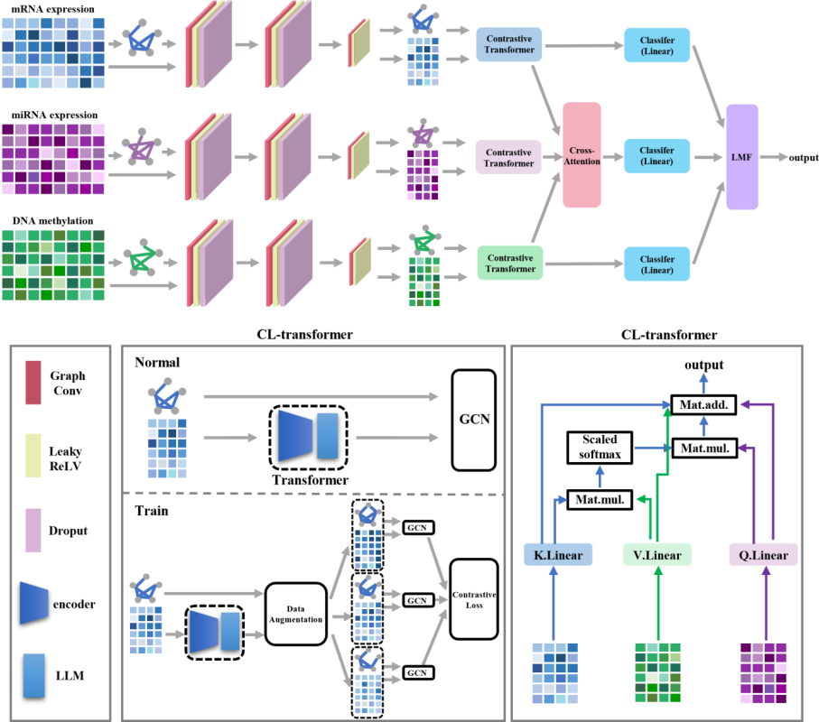

# BOMIFA
BOMIFA is an advanced computing framework specifically designed for predicting the prognosis of female patients with cancer. By integrating multiple types of omics data with biological pathway knowledge, BOMIFA is capable of providing accurate and understandable prediction results for cancer outcomes, as well as identifying significant clinical value biomarkers for female cancers.


## Repository Structure
BOMIFA/
├── README.md                         # Project documentation
├── requirements.txt                  # List of dependencies
│
├── UCEC/                             # Example dataset (Uterine Corpus Endometrial Carcinoma)
│   ├── fold1_test_labels.csv         # Test set labels for fold 1
│   ├── fold1_train_labels.csv        # Training set labels for fold 1
│   └── surv_time.csv                 # Survival time and event information
│
├── preprocessed/                     # Preprocessed multi-omics feature data
│   ├── X_test_methyl.csv             # Test set: DNA methylation
│   ├── X_test_mirna.csv              # Test set: miRNA expression
│   ├── X_test_mrna.csv               # Test set: mRNA expression
│   ├── X_train_methyl.csv            # Training set: DNA methylation
│   ├── X_train_mirna.csv             # Training set: miRNA expression
│   └── X_train_mrna.csv              # Training set: mRNA expression
│
├── core_modules/                     # Core functional modules (categorized)
│   ├── attention_modules.py          # Attention mechanism layers (GNN/Transformer)
│   ├── contrastive_learning.py       # Contrastive learning losses and modules
│   ├── cox_loss.py                   # Cox loss function for survival analysis
│   ├── gnn_modules.py                # Graph neural network (GNN) layer definitions
│   ├── lmf_fusion.py                 # Low-rank multi-modal fusion (LMF)
│   ├── transformer_fusion.py         # Single-modal Transformer encoder
│   └── omics_fusion_model.py         # Detailed LMF implementation (fusion model)
│
├── pipeline/                         # Training and execution pipeline
│   ├── training_pipeline.py          # BOMIFA end-to-end core pipeline
│   ├── train_test.py                 # Training and testing loop functions
│   ├── models.py                     # Complete BOMIFA model definition
│   ├── processing.py                 # Data preprocessing pipeline
│   └── utils.py                      # Utility functions (metrics, weights, adjacency matrices, etc.)
│
├── main_bomifa.py                    # Main entry script (set hyperparameters and launch training)
└── main_fine_marker.py               # Biomarker extraction and saliency analysis script


## Dataset
This project uses transcriptomic and survival data
├── UCEC/                        # UCEC (Uterine Corpus Endometrial Carcinoma) dataset folder
│   ├── fold1_test_labels.csv    # Test set labels for the 1st fold in 5-fold cross-validation
│   ├── fold1_train_labels.csv   # Training set labels for the 1st fold in 5-fold cross-validation
│   └── surv_time.csv            # Survival time and event information for survival analysis


├── preprocessed/                # Preprocessed multi-omics feature data (standardized & filtered)
│   ├── X_test_methyl.csv        # Test set: DNA methylation features
│   ├── X_test_mirna.csv         # Test set: miRNA expression features
│   ├── X_test_mrna.csv          # Test set: mRNA expression features
│   ├── X_train_methyl.csv       # Training set: DNA methylation features
│   ├── X_train_mirna.csv        # Training set: miRNA expression features
│   └── X_train_mrna.csv         # Training set: mRNA expression features

## Usage


### Data Preprocessing

Run the preprocessing script to generate the `preprocessed/` folder:

python processing.py

### processing.py  
The multi-omics data preprocessing pipeline consists of five key steps to ensure robust and biologically meaningful feature representation:

1. **Data Loading & Sample Alignment**  
   Raw mRNA, DNA methylation, and miRNA expression data are loaded and aligned with the corresponding training and test sample labels from the UCEC dataset.

2. **Variance Filtering**  
   Low-variance features are removed to reduce noise. Separate thresholds are applied for mRNA, methylation, and miRNA data. For miRNA, only the top 1000 features with the highest variance are retained.

3. **FDR + PCA Feature Selection**  
   Statistical feature selection is performed using ANOVA F-test followed by FDR correction. PCA is then applied to ensure the first principal component explains less than 50% variance, avoiding over-dominant features. Up to 1000 significant features are retained for mRNA and methylation.

4. **Min-Max Normalization**  
   All features are normalized to the range [0, 1] using statistics computed solely from the training set to prevent data leakage.

5. **Output Saving**  
   Preprocessed training and test sets for all three modalities are saved into the `preprocessed/` directory for model training.

   
python main_bomifa.py

### Parameters(main_bomifa.py)
| Parameter                | Description                                                                 |
|--------------------------|-----------------------------------------------------------------------------|
| data_folder              | Path to the dataset directory                                               |
| view_list                | List of multi-omics modalities (mRNA, miRNA, methylation)                  |
| num_epoch_pretrain       | Number of epochs for GNN pre-training                                      |
| transformer_epochs       | Number of epochs for contrastive learning Transformer training              |
| lr_e_gcn                 | Learning rate for the GNN encoder                                          |
| lr_e_cl_transformer      | Learning rate for the contrastive learning Transformer encoder             |
| n_head                   | Number of attention heads in the single-modal Transformer                  |
| d_ff                     | Hidden dimension of the Transformer feed-forward network (FFN)              |
| num_layers               | Number of stacked layers in the Transformer module                          |
| cross_num_heads          | Number of attention heads in the cross-attention module                      |
| d_model                  | Dimension of the model feature embedding                                    |
| rank                     | Rank parameter for the low-rank multi-modal fusion (LMF) module             |
| lr_cross_attention       | Learning rate for the cross-attention module                                |
| lr_c                     | Learning rate for the classifier layer                                      |
| all_lr                   | Learning rate for the joint training of the entire model                    |
| num_classes              | Number of classes for the classification task (binary classification)       |


### main_bomifa.py
main_bomifa.py runs on preprocessed data and uses one fold out of five (fold 1) for training/testing.
To run the BOMIFA pipeline, you need to place your configuration code inside the main_bomifa.py file. This file acts as the user-facing script, calling the core model_prepare function to execute the complete training and evaluation workflow. 
### main_bomifa.py
model_prepare serves as the training entry function of the BOMIFA framework. It first loads the corresponding hyperparameters (adjacency matrix parameter and GCN hidden layer dimensions) according to the dataset name (e.g., UCEC), then creates the model saving directory, calls prepare_trte_data to read the multi‑omics data and the first‑fold cross‑validation indices, splits the training/testing features and labels, converts them into tensors, and generates one‑hot labels and sample weights. It then constructs graph adjacency matrices via gen_trte_adj_mat. Finally, it passes all data and hyperparameters to train_test, which sequentially executes GNN pre‑training, Transformer contrastive learning, cross‑attention training, final fusion, and end‑to‑end fine‑tuning, while outputting loss curves, classification metrics (accuracy, F1, AUC) and the survival C‑index, as well as saving the best model parameters.
### train_test.py

#### train_epoch_gnn
This function performs one training epoch for the GNN pretraining stage. It iterates over each omics view, takes the corresponding data and adjacency matrix, computes the survival‑related Cox loss using the GNN encoder and a view‑specific classifier, backpropagates the loss, and updates the optimizer for that view. The function returns a list of losses for all views.

 

#### train_epoch_transform
This function handles one training epoch for the contrastive Transformer stage. For each view, it obtains the output of the GNN encoder, passes it through a Transformer module (H), then through two separate predictors: a direct classifier (C) and a GCN‑based predictor (P) that uses the adjacency matrix and the label. The two losses are combined by a DynamicLossBalancer, and the combined loss is backpropagated through the view‑specific optimizer. The function returns the list of combined losses for each view.

#### train_cross_attention
This function trains the cross‑attention module (D) for one epoch. It first extracts features from each view using the GNN encoder, Transformer, and the predictor P to obtain projected features. These three projected feature sets are fed into the cross‑attention module, whose output is classified by a dedicated classifier (C3). The resulting Cox loss is backpropagated, gradients are clipped for stability, and the optimizer for the cross‑attention module (R) is updated. The function returns the loss value.

#### train_epoch_final
The train_epoch_final, it backpropagates the Cox loss through the dedicated optimizer A, which is configured with a lower learning rate (all_lr) to jointly fine‑tune all modules in the model. This stage corresponds to the final joint training phase, where the whole framework is refined together for optimal performance.#### test_epoch
This function evaluates the model on a test set. It puts all sub‑models in evaluation mode, processes each view to obtain projected features, and then generates predictions either by fusing the three predictions (if there are at least two views) or by simply using the single‑view features. The output scores are converted to probabilities using the sigmoid function, and the raw scores (logits) are returned as a NumPy array for further metric calculation.


### Loss Outputs
oss_gnn_pretraining.png: Loss curve of the graph neural network (GNN) pretraining stage.
loss_transformer_training.png: Loss curve of the single-modal Transformer training stage.
loss_cross_attention.png: Loss curve of the cross-attention module during multi-modal fusion learning.
loss_final_training.png: Final end-to-end training loss curve of the complete BOMIFA framework.


### Evaluation Metrics

#### calculate_classification_metrics
All evaluation metrics are computed by the **`calculate_classification_metrics`** function in **`utils.py`**.

This function automatically calculates the following performance scores for model evaluation:
Accuracy: Proportion of correct predictions among all tested samples.
F1-score: Harmonic mean of precision and recall, utilized to evaluate model performance on imbalanced datasets.
AUC (Area Under Curve): Area under the ROC curve, measuring the overall binary classification discrimination ability of the model.
C-index (Concordance Index): A key metric for assessing the predictive performance of survival prognosis models.


### main_fine_marker.py (Marker Output)

This code performs global saliency analysis on three types of multi-omics data (mRNA, miRNA, and DNA methylation). It iterates through each modality, dynamically loads a pre-trained combined model (comprising GCN_E, Transformer, GCN_comp, and a classifier) based on the input feature dimensions, and then uses a TrainedModelSaliencyAnalyzer to compute feature importance scores with respect to a given prediction label (pred_label). The top 500 most important features are selected. The corresponding feature names are read from {a}_featname.csv files, and both the names and importance scores are saved as CSV files (0_features.csv, 1_features.csv, 2_features.csv) in the ./{data_folder}/marker/ directory. The indices, names, and scores are also printed, ultimately helping to identify key biomarkers.

#### load_trained_model function
This function loads pre‑trained weights for each of the four sub‑models from saved .pth files, given a specific modality index i, training epoch num, and data folder path. It instantiates GCN_E, the Transformer fusion model (all), GCN_comp, and Classifier with the provided dimensions and hyperparameters, then loads the corresponding checkpoint files (e.g., E{i}.pth, H{i}.pth, P{i}.pth, C{i}.pth). After setting all sub‑models to evaluation mode, it wraps them inside a CombinedModel instance and returns the ready‑to‑use composite model.


#### run_saliency function
This function performs global saliency analysis on three omics modalities (mRNA, miRNA, methylation) to identify the top 500 features that most influence a given prediction label. It loops over each modality, loads the corresponding trained CombinedModel by calling load_trained_model, and uses a TrainedModelSaliencyAnalyzer to compute feature importance scores from the input features and adjacency matrix. 


## Framework

The BOMIFA framework takes three types of multi-omics data (mRNA expression, miRNA expression, and DNA methylation) as input. Each modality first undergoes feature extraction through graph convolution (Graph Conv), Leaky ReLU activation, and dropout operations, followed by representation learning via the Contrastive Transformer (CL-transformer) module. In this module, data augmentation generates multiple views of the input features, which are then processed by a graph convolutional network (GCN) and optimized using contrastive loss to learn robust single-modal representations. Subsequently, features from all three modalities are fed into a cross-attention module, where query, key, and value matrices are generated via linear projections. Attention weights are computed through matrix multiplication and scaled softmax, enabling effective inter-modal information interaction. Finally, outputs from each modality-specific classifier and the cross-attention module are integrated into the Low-Rank Multi-modal Fusion (LMF) block, which performs the ultimate multi-omics feature fusion to produce the final prediction.


## Requirements
- Python 3.9+  We do not recommend using Python versions higher than 3.11, as they often lead to dependency conflicts between deep learning frameworks including TensorFlow, PyTorch, and DGL.
- Tensorflow==2.18+
- Other dependencies listed in `requirements.txt`
```bash
git clone https://github.com/anbai01/BOMIFA.git
conda create -n bomifa python=3.9
conda activate bomifa
pip install -r requirements.txt
```


## GPU/CPU Support
The code automatically detects GPU availability:
GPU available: Uses CUDA for training (recommended)
CPU only: Falls back to CPU (slower but functional)


